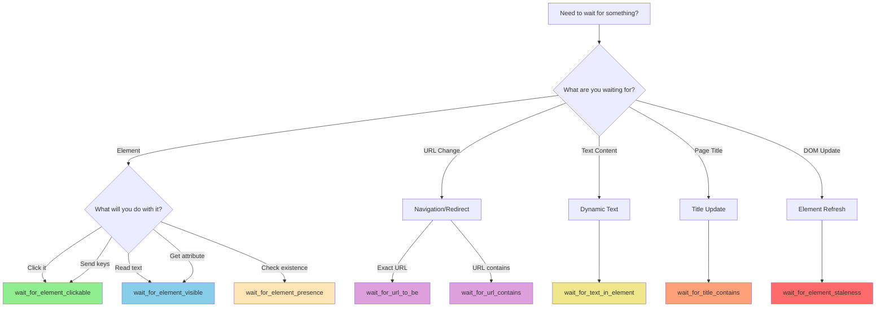

# Wait Strategies Guide

Comprehensive guide to using explicit waits effectively in the test automation framework, eliminating Thread.sleep() anti-patterns and ensuring reliable test synchronization.

## Table of Contents

- [Overview](#overview)
- [The Explicit Waits Only Pattern](#the-explicit-waits-only-pattern)
- [Complete Wait Method Catalog](#complete-wait-method-catalog)
- [Wait Decision Tree](#wait-decision-tree)
- [Configurable Timeout Configuration](#configurable-timeout-configuration)
- [BasePage Wait Integration](#basepage-wait-integration)
- [Custom Wait Conditions](#custom-wait-conditions)
- [Wait Anti-Patterns to Avoid](#wait-anti-patterns-to-avoid)
- [Best Practices](#best-practices)
- [Performance Optimization](#performance-optimization)
- [Troubleshooting](#troubleshooting)

## Overview

**Purpose:** This guide documents the explicit wait strategies used throughout the test automation framework to ensure reliable, predictable test synchronization.

**When to use this guide:**
- Writing new test automation code that interacts with web elements
- Debugging flaky tests caused by timing issues
- Understanding which wait method to use for specific scenarios
- Optimizing test execution performance
- Migrating from implicit waits or Thread.sleep() patterns

**Prerequisites:**
- Basic understanding of Selenium WebDriver
- Familiarity with the Page Object Model pattern
- Python test automation framework installed and configured

## The Explicit Waits Only Pattern

### Migration from Java Anti-Patterns

The Python/Behave framework eliminates problematic wait patterns from the original Java implementation:

**Problems Solved:**

1. **Global Implicit Wait Removed**
   - **Java (Driver.java line 34):** `driver.manage().timeouts().implicitlyWait(10, TimeUnit.SECONDS);`
   - **Problem:** 10-second implicit wait mixed with explicit waits, creating unpredictable compound wait behavior
   - **Python Solution:** Implicit wait set to 0 in config.yaml, all waits are explicit
   - **Benefit:** Predictable, condition-based synchronization with clear timeout visibility

2. **Thread.sleep() Eliminated**
   - **Java (LoginSD.java line 27):** `Thread.sleep(3000);`
   - **Java (Contacts.java):** Multiple 3-second sleeps scattered throughout
   - **Problem:** Fixed delays regardless of actual page state, causing flaky tests or slow execution
   - **Python Solution:** Condition-based waits that proceed as soon as condition is met
   - **Benefit:** Faster execution (waits only as long as needed) and more reliable tests

3. **Hardcoded Timeout Values Centralized**
   - **Java Problem:** Timeouts scattered across step definitions (2s, 3s, 7s, 20s hardcoded)
   - **Python Solution:** Configurable timeout values from config.yaml
   - **Benefit:** Consistent wait behavior, easy tuning for different environments

### Architecture Principle

**Explicit Waits Only:**

```python
# ❌ NEVER use implicit waits (causes unpredictable behavior)
driver.implicitly_wait(10)  # DON'T DO THIS

# ❌ NEVER use Thread.sleep() (fixed delays are unreliable)
import time
time.sleep(3)  # DON'T DO THIS

# ✅ ALWAYS use explicit waits with expected conditions
from selenium.webdriver.support.ui import WebDriverWait
from selenium.webdriver.support import expected_conditions as EC

wait = WebDriverWait(driver, 10)
element = wait.until(EC.presence_of_element_located((By.ID, "email")))
```

**Why Explicit Waits Only:**

- **Predictable:** Wait only for specific condition, proceed immediately when met
- **Debuggable:** Clear timeout messages indicate which condition failed
- **Configurable:** Different timeouts for different operations (fast vs. slow)
- **Reliable:** No race conditions from mixed wait strategies
- **Efficient:** Proceed as soon as condition is met, no fixed delays

**Source:** `utilities/wait_helpers.py` lines 1-40, `config/config.yaml` line 38

## Complete Wait Method Catalog

The framework provides two levels of wait utilities:

1. **WaitHelpers Class:** Comprehensive wait methods for step definitions
2. **BasePage Methods:** Integrated wait methods for page objects

### WaitHelpers Class Methods

#### wait_for_element_presence()

Wait for element to be present in the DOM (not necessarily visible).

**When to use:**
- Element must exist in DOM but may be hidden
- Checking for element presence before further interaction
- Loading dynamic content via AJAX

**Signature:**
```python
def wait_for_element_presence(
    self,
    locator: Tuple[By, str],
    timeout: Optional[int] = None
) -> WebElement
```

**Example:**
```python
from utilities.wait_helpers import WaitHelpers
from selenium.webdriver.common.by import By

wait_helper = WaitHelpers(driver)

# Wait for element with default timeout (10s from config)
element = wait_helper.wait_for_element_presence((By.NAME, "login"))
element.send_keys("user@example.com")

# Wait with custom timeout for slow-loading element
slow_element = wait_helper.wait_for_element_presence(
    (By.ID, "slow-content"),
    timeout=30
)
```

**Returns:** WebElement when present in DOM  
**Raises:** TimeoutException if element not found within timeout  
**Source:** `utilities/wait_helpers.py` lines 192-258

#### wait_for_element_visible()

Wait for element to be visible (present in DOM and displayed on screen).

**When to use:**
- Element must be visible to user
- Waiting for animations or transitions to complete
- Ensuring element is ready for user interaction
- Confirming modals or alerts appear

**Signature:**
```python
def wait_for_element_visible(
    self,
    locator: Tuple[By, str],
    timeout: Optional[int] = None
) -> WebElement
```

**Visibility Requirements:**
- Element exists in DOM
- Element has height and width > 0
- Element not hidden (no `display:none` or `visibility:hidden`)
- Element not covered by other elements

**Example:**
```python
# Wait for modal to become visible
modal = wait_helper.wait_for_element_visible((By.CLASS_NAME, "modal"))
assert modal.is_displayed()

# Wait for success message after form submission
message = wait_helper.wait_for_element_visible(
    (By.ID, "success-message"),
    timeout=5
)
print(message.text)
```

**Returns:** WebElement when visible  
**Raises:** TimeoutException if element not visible within timeout  
**Source:** `utilities/wait_helpers.py` lines 260-324

#### wait_for_element_clickable()

Wait for element to be clickable (visible and enabled).

**When to use:**
- About to click an element (button, link, checkbox)
- Waiting for button/link to become enabled
- Ensuring element is interactive before action
- **This is the recommended wait before any click() operation**

**Signature:**
```python
def wait_for_element_clickable(
    self,
    locator: Tuple[By, str],
    timeout: Optional[int] = None
) -> WebElement
```

**Clickable Requirements:**
- Element is visible on the page
- Element is enabled (no `disabled` attribute)
- Element is not obscured by other elements

**Example:**
```python
# Wait for button to be clickable then click
login_btn = wait_helper.wait_for_element_clickable(
    (By.XPATH, "//button[.='Log in']")
)
login_btn.click()

# Wait for link with custom timeout
next_link = wait_helper.wait_for_element_clickable(
    (By.LINK_TEXT, "Next Page"),
    timeout=15
)
next_link.click()
```

**Returns:** WebElement when clickable  
**Raises:** TimeoutException if element not clickable within timeout  
**Source:** `utilities/wait_helpers.py` lines 326-394

#### wait_for_text_in_element()

Wait for specific text to appear in an element.

**When to use:**
- Waiting for dynamic text to load (AJAX responses)
- Validating success/error messages appear
- Confirming page state through text content
- Checking status indicators changed

**Signature:**
```python
def wait_for_text_in_element(
    self,
    locator: Tuple[By, str],
    text: str,
    timeout: Optional[int] = None
) -> bool
```

**Text Matching:**
- Case-sensitive substring match
- Text must be present anywhere in element's visible text
- Includes text from child elements

**Example:**
```python
# Wait for success message after form submission
wait_helper.wait_for_text_in_element(
    (By.ID, "message"),
    "Registration successful"
)

# Wait for status update with custom timeout
wait_helper.wait_for_text_in_element(
    (By.CLASS_NAME, "status-indicator"),
    "Active",
    timeout=20
)
```

**Returns:** True if text appears within timeout  
**Raises:** TimeoutException if text doesn't appear (includes actual text in error message)  
**Source:** `utilities/wait_helpers.py` lines 396-480

#### wait_for_element_staleness()

Wait for element to become stale (removed from DOM or DOM updated).

**When to use:**
- Waiting for DOM updates after AJAX operations
- Confirming page reload or partial refresh
- Avoiding StaleElementReferenceException
- Ensuring old element reference is invalid before re-finding

**Signature:**
```python
def wait_for_element_staleness(
    self,
    element: WebElement,
    timeout: Optional[int] = None
) -> bool
```

**Important:** This method takes a WebElement instance, not a locator tuple.

**Example:**
```python
# Wait for table row to be removed after delete action
row = driver.find_element(By.ID, "row-123")
delete_button.click()
wait_helper.wait_for_element_staleness(row)

# Confirm element is refreshed after DOM update
old_element = driver.find_element(By.ID, "dynamic-content")
refresh_button.click()
wait_helper.wait_for_element_staleness(old_element)
# Now safe to re-find the element
new_element = wait_helper.wait_for_element_presence((By.ID, "dynamic-content"))
```

**Returns:** True if element becomes stale within timeout  
**Raises:** TimeoutException if element doesn't become stale  
**Source:** `utilities/wait_helpers.py` lines 482-549

#### wait_for_url_contains()

Wait for current URL to contain specified fragment.

**When to use:**
- Waiting for navigation after action (login, form submit)
- Confirming redirect to expected page
- Validating routing in single-page applications

**Signature:**
```python
def wait_for_url_contains(
    self,
    url_fragment: str,
    timeout: Optional[int] = None
) -> bool
```

**Example:**
```python
# Wait for login redirect
login_button.click()
wait_helper.wait_for_url_contains("/dashboard")
print(f"Navigated to: {driver.current_url}")

# Wait for URL parameter after form submission
submit_button.click()
wait_helper.wait_for_url_contains("success=true", timeout=5)
```

**Returns:** True if URL contains fragment within timeout  
**Raises:** TimeoutException if URL doesn't contain fragment (includes current URL in error)  
**Source:** `utilities/wait_helpers.py` lines 551-619

#### wait_for_url_to_be()

Wait for current URL to exactly match expected URL.

**When to use:**
- Expecting exact URL match after navigation
- Validating complete URL including parameters
- Stricter validation than `wait_for_url_contains()`

**Signature:**
```python
def wait_for_url_to_be(
    self,
    url: str,
    timeout: Optional[int] = None
) -> bool
```

**Example:**
```python
# Wait for exact URL after redirect
logout_link.click()
wait_helper.wait_for_url_to_be("https://app.example.com/login")
```

**Returns:** True if URL matches exactly within timeout  
**Raises:** TimeoutException if URL doesn't match  
**Source:** `utilities/wait_helpers.py` lines 621-674

#### wait_for_title_contains()

Wait for page title to contain specified text.

**When to use:**
- Waiting for page load completion
- Validating correct page after navigation
- Checking for dynamic title updates

**Signature:**
```python
def wait_for_title_contains(
    self,
    title_fragment: str,
    timeout: Optional[int] = None
) -> bool
```

**Example:**
```python
# Validate page title after navigation
dashboard_link.click()
wait_helper.wait_for_title_contains("User Dashboard")
assert "Dashboard" in driver.title
```

**Returns:** True if title contains fragment within timeout  
**Raises:** TimeoutException if title doesn't contain fragment  
**Source:** `utilities/wait_helpers.py` lines 676-741

### Wait Method Summary Table

| Method | Use Case | Checks | Speed |
|--------|----------|--------|-------|
| `wait_for_element_presence()` | Element exists in DOM | DOM presence only | Fastest |
| `wait_for_element_visible()` | Element visible to user | Visible + height/width > 0 | Fast |
| `wait_for_element_clickable()` | About to click element | Visible + enabled + not obscured | Medium |
| `wait_for_text_in_element()` | Verify text content | Text present in element | Medium |
| `wait_for_element_staleness()` | DOM update confirmation | Element removed/refreshed | Variable |
| `wait_for_url_contains()` | Navigation confirmation | URL substring match | Fast |
| `wait_for_url_to_be()` | Exact URL validation | URL exact match | Fast |
| `wait_for_title_contains()` | Page load validation | Title substring match | Fast |

## Wait Decision Tree

Use this decision tree to choose the appropriate wait method for your scenario:



### Decision Tree Explanation

**For Element Interactions:**

1. **About to click?** → `wait_for_element_clickable()`
   - Ensures button/link is visible, enabled, and not obscured
   - Most reliable for click operations

2. **Reading text or attributes?** → `wait_for_element_visible()`
   - Ensures element is displayed on screen
   - Guarantees text/attributes are rendered

3. **Just checking if element exists?** → `wait_for_element_presence()`
   - Fastest option if visibility not required
   - Useful for hidden elements or background checks

**For Navigation:**

4. **Need exact URL match?** → `wait_for_url_to_be()`
   - Strictest validation for complete URL

5. **Just need URL to contain text?** → `wait_for_url_contains()`
   - More flexible for dynamic parameters

**For Content Updates:**

6. **Waiting for specific text to appear?** → `wait_for_text_in_element()`
   - Perfect for success/error messages
   - Validates dynamic content loading

7. **Waiting for page title change?** → `wait_for_title_contains()`
   - Good for page load confirmation

**For DOM Updates:**

8. **Waiting for element to be removed/refreshed?** → `wait_for_element_staleness()`
   - Prevents StaleElementReferenceException
   - Confirms DOM update completed

## Configurable Timeout Configuration

All wait methods support configurable timeouts from `config/config.yaml`.

### Timeout Configuration Structure

**File:** `config/config.yaml`

```yaml
timeouts:
  # Default explicit wait timeout in seconds
  # Used when no custom timeout specified
  explicit: 10
  
  # Page load timeout in seconds
  # Maximum time to wait for page load event
  page_load: 30
  
  # Element presence timeout in seconds
  # For waiting until element is present in DOM
  element_presence: 5
  
  # Element clickability timeout in seconds
  # For waiting until element is clickable
  clickability: 3
```

**Source:** `config/config.yaml` lines 45-60

### Timeout Precedence

Timeouts are applied in the following order of precedence:

1. **Method-level custom timeout** (highest priority)
2. **Configuration file timeout** (config.yaml)
3. **Hardcoded default** (10 seconds fallback)

**Example:**

```python
from utilities.wait_helpers import WaitHelpers
from selenium.webdriver.common.by import By

wait_helper = WaitHelpers(driver)

# Uses config.yaml timeouts.explicit (10s)
element1 = wait_helper.wait_for_element_clickable((By.ID, "button1"))

# Uses custom timeout (overrides config)
element2 = wait_helper.wait_for_element_clickable(
    (By.ID, "slow-button"),
    timeout=30  # 30 seconds for slow-loading element
)

# Uses config.yaml timeouts.explicit if available, falls back to 10s
element3 = wait_helper.wait_for_element_presence((By.NAME, "email"))
```

### Environment-Specific Timeout Configuration

Different environments may require different timeout values:

**Local Development (fast):**
```yaml
timeouts:
  explicit: 5
  page_load: 15
```

**CI/CD Environment (slower):**
```yaml
timeouts:
  explicit: 15
  page_load: 60
```

**Production Staging (network delays):**
```yaml
timeouts:
  explicit: 20
  page_load: 90
```

**Recommendation:** Use environment variables for timeout customization:

```yaml
timeouts:
  explicit: ${EXPLICIT_TIMEOUT:10}
  page_load: ${PAGE_LOAD_TIMEOUT:30}
```

## BasePage Wait Integration

Page objects inherit wait utilities from `BasePage`, providing integrated wait methods with property-based locators.

### Property-Based Locator Pattern

**Problem Solved:** Prevents StaleElementReferenceException by calling wait methods each time property is accessed, ensuring fresh element references.

**Pattern:**

```python
from pages.base_page import BasePage
from selenium.webdriver.common.by import By

class LoginPage(BasePage):
    # Define locators as private class constants (tuples)
    _INPUT_EMAIL = (By.NAME, "login")
    _INPUT_PASSWORD = (By.NAME, "password")
    _BUTTON_LOGIN = (By.XPATH, "//button[.='Log in']")
    
    # Use @property decorators that call wait methods
    @property
    def input_email(self):
        """Email input field (waits for presence)"""
        return self.wait_for_element(self._INPUT_EMAIL)
    
    @property
    def input_password(self):
        """Password input field (waits for presence)"""
        return self.wait_for_element(self._INPUT_PASSWORD)
    
    @property
    def button_login(self):
        """Login button (waits for clickability)"""
        return self.wait_for_clickable(self._BUTTON_LOGIN)
    
    # High-level action methods
    def login(self, username, password):
        """Perform login with credentials"""
        self.input_email.send_keys(username)  # Waits automatically
        self.input_password.send_keys(password)  # Waits automatically
        self.button_login.click()  # Waits for clickable automatically
```

**Source:** `pages/base_page.py` lines 1-47, `pages/login_page.py` pattern example

### BasePage Wait Methods

BasePage provides these wait methods for page objects:

#### wait_for_element()

Wait for element presence in DOM.

**Usage in Page Objects:**
```python
@property
def some_element(self):
    return self.wait_for_element(self._SOME_ELEMENT)
```

**Source:** `pages/base_page.py` lines 166-228

#### wait_for_clickable()

Wait for element to be clickable (visible and enabled).

**Usage in Page Objects:**
```python
@property
def submit_button(self):
    return self.wait_for_clickable(self._SUBMIT_BUTTON)
```

**Source:** `pages/base_page.py` lines 230-300

#### wait_for_visibility()

Wait for element to be visible.

**Usage in Page Objects:**
```python
@property
def success_message(self):
    return self.wait_for_visibility(self._SUCCESS_MESSAGE)
```

**Source:** `pages/base_page.py` lines 302-371

#### wait_for_text()

Wait for specific text in element.

**Usage in Page Objects:**
```python
def verify_welcome_message(self, username):
    """Verify welcome message contains username"""
    return self.wait_for_text(
        self._WELCOME_MESSAGE,
        f"Welcome, {username}"
    )
```

**Source:** `pages/base_page.py` lines 373-453

### When to Use Which BasePage Method

| Scenario | Method | Reasoning |
|----------|--------|-----------|
| Input field property | `wait_for_element()` | Just needs to exist for send_keys() |
| Button property | `wait_for_clickable()` | Must be clickable before click() |
| Display-only text | `wait_for_visibility()` | Must be visible to read text |
| Dynamic text validation | `wait_for_text()` | Validates specific text appears |
| Link property | `wait_for_clickable()` | Must be clickable for navigation |
| Checkbox/radio | `wait_for_clickable()` | Must be clickable for interaction |

## Custom Wait Conditions

For scenarios not covered by standard wait methods, create custom wait conditions using `expected_conditions` or lambda functions.

### Using Expected Conditions

Selenium provides many built-in expected conditions in `selenium.webdriver.support.expected_conditions`:

```python
from selenium.webdriver.support.ui import WebDriverWait
from selenium.webdriver.support import expected_conditions as EC
from selenium.webdriver.common.by import By

# Wait for element to be selected (checkbox/radio)
wait = WebDriverWait(driver, 10)
checkbox = wait.until(
    EC.element_to_be_selected((By.ID, "agree-terms"))
)

# Wait for element attribute to contain specific value
wait.until(
    EC.text_to_be_present_in_element_attribute(
        (By.ID, "status"),
        "class",
        "active"
    )
)

# Wait for number of windows to be specific value
wait.until(EC.number_of_windows_to_be(2))

# Wait for alert to be present
alert = wait.until(EC.alert_is_present())
```

### Custom Lambda Wait Conditions

Create custom wait conditions using lambda functions:

```python
from selenium.webdriver.support.ui import WebDriverWait
from selenium.webdriver.common.by import By

# Wait for element count to be specific value
wait = WebDriverWait(driver, 10)
wait.until(
    lambda d: len(d.find_elements(By.CLASS_NAME, "item")) == 5,
    message="Expected 5 items but found different count"
)

# Wait for element text to match regex pattern
import re
wait.until(
    lambda d: re.match(
        r"\d{3}-\d{3}-\d{4}",
        d.find_element(By.ID, "phone").text
    ),
    message="Phone number not in expected format"
)

# Wait for element attribute to change
old_value = driver.find_element(By.ID, "counter").text
button.click()
wait.until(
    lambda d: d.find_element(By.ID, "counter").text != old_value,
    message="Counter value did not change"
)

# Wait for element to stop moving (animation complete)
def element_position_stable(locator, duration=0.5):
    """Wait for element position to be stable for specified duration"""
    def check_stable(driver):
        element = driver.find_element(*locator)
        first_pos = element.location
        import time
        time.sleep(duration)  # Only acceptable use of sleep - checking stability
        second_pos = element.location
        return first_pos == second_pos
    return check_stable

wait.until(
    element_position_stable((By.ID, "animated-element"), duration=0.5)
)
```

### Creating Reusable Custom Wait Classes

For frequently used custom waits, create reusable classes:

```python
from selenium.webdriver.support.ui import WebDriverWait
from selenium.webdriver.common.by import By

class CustomExpectedConditions:
    """Custom expected condition classes for reusable wait logic"""
    
    @staticmethod
    def element_count_to_be(locator, count):
        """Wait for specific number of elements matching locator"""
        def check_count(driver):
            elements = driver.find_elements(*locator)
            if len(elements) == count:
                return elements
            return False
        return check_count
    
    @staticmethod
    def element_has_css_class(locator, css_class):
        """Wait for element to have specific CSS class"""
        def check_class(driver):
            element = driver.find_element(*locator)
            classes = element.get_attribute("class")
            if css_class in classes:
                return element
            return False
        return check_class
    
    @staticmethod
    def page_is_loaded():
        """Wait for page to fully load (document.readyState == complete)"""
        def check_loaded(driver):
            return driver.execute_script("return document.readyState") == "complete"
        return check_loaded

# Usage
wait = WebDriverWait(driver, 10)

# Wait for 10 items to be present
items = wait.until(
    CustomExpectedConditions.element_count_to_be(
        (By.CLASS_NAME, "product"),
        10
    )
)

# Wait for element to have 'active' class
element = wait.until(
    CustomExpectedConditions.element_has_css_class(
        (By.ID, "menu"),
        "active"
    )
)

# Wait for page to be fully loaded
wait.until(CustomExpectedConditions.page_is_loaded())
```

## Wait Anti-Patterns to Avoid

Common wait anti-patterns that lead to flaky tests or poor performance:

### ❌ Anti-Pattern 1: Using Thread.sleep()

**Problem:** Fixed delays regardless of actual page state

```python
import time

# ❌ DON'T DO THIS
driver.find_element(By.ID, "login").send_keys("user@example.com")
time.sleep(3)  # Hope page loaded in 3 seconds
driver.find_element(By.ID, "password").send_keys("password")
```

**Solution:** Use explicit waits

```python
# ✅ DO THIS INSTEAD
from utilities.wait_helpers import WaitHelpers
wait_helper = WaitHelpers(driver)

driver.find_element(By.ID, "login").send_keys("user@example.com")
wait_helper.wait_for_element_clickable((By.ID, "password"))
driver.find_element(By.ID, "password").send_keys("password")
```

**Source:** Java migration - eliminated Thread.sleep from LoginSD.java line 27

### ❌ Anti-Pattern 2: Using Implicit Waits

**Problem:** Unpredictable behavior when mixed with explicit waits

```python
# ❌ DON'T DO THIS
driver.implicitly_wait(10)  # Global 10-second wait

# Later in code...
wait = WebDriverWait(driver, 5)  # Now have both implicit and explicit
element = wait.until(EC.presence_of_element_located((By.ID, "button")))
# Actual wait time unpredictable: could be 5s, 10s, or 15s
```

**Solution:** Use explicit waits only

```python
# ✅ DO THIS INSTEAD
# In config.yaml: implicit_wait: 0
# All waits are explicit and predictable

wait = WebDriverWait(driver, 5)
element = wait.until(EC.presence_of_element_located((By.ID, "button")))
# Clear 5-second timeout
```

**Source:** `config/config.yaml` line 38 - implicit_wait set to 0

### ❌ Anti-Pattern 3: Not Handling TimeoutException

**Problem:** Tests fail with unclear error messages

```python
# ❌ DON'T DO THIS
element = wait_helper.wait_for_element_clickable((By.ID, "submit"))
element.click()
# If timeout occurs, generic error doesn't help debugging
```

**Solution:** Handle TimeoutException with clear context

```python
# ✅ DO THIS INSTEAD
from selenium.common.exceptions import TimeoutException

try:
    element = wait_helper.wait_for_element_clickable(
        (By.ID, "submit"),
        timeout=10
    )
    element.click()
except TimeoutException:
    # Log helpful context for debugging
    print(f"Submit button not clickable after 10s")
    print(f"Current URL: {driver.current_url}")
    print(f"Page title: {driver.title}")
    raise
```

### ❌ Anti-Pattern 4: Using find_element Without Wait

**Problem:** Race condition if element not yet loaded

```python
# ❌ DON'T DO THIS
button = driver.find_element(By.ID, "submit")  # May fail if not loaded yet
button.click()
```

**Solution:** Always use wait before interaction

```python
# ✅ DO THIS INSTEAD
button = wait_helper.wait_for_element_clickable((By.ID, "submit"))
button.click()
```

### ❌ Anti-Pattern 5: Overly Long Timeouts

**Problem:** Slow test execution when timeouts too high

```python
# ❌ DON'T DO THIS
wait_helper.wait_for_element_clickable((By.ID, "fast-button"), timeout=60)
# 60-second timeout for element that usually appears in 1 second
```

**Solution:** Use appropriate timeouts for the operation

```python
# ✅ DO THIS INSTEAD
# Fast-loading elements: 3-5 seconds
wait_helper.wait_for_element_clickable((By.ID, "fast-button"), timeout=5)

# Normal operations: 10 seconds (default)
wait_helper.wait_for_element_clickable((By.ID, "normal-button"))

# Slow operations: 20-30 seconds
wait_helper.wait_for_element_clickable((By.ID, "slow-button"), timeout=30)
```

### ❌ Anti-Pattern 6: Polling Too Aggressively

**Problem:** Excessive CPU and network load from tight polling loops

```python
# ❌ DON'T DO THIS
import time
while True:
    try:
        element = driver.find_element(By.ID, "button")
        if element.is_displayed():
            break
    except:
        pass
    time.sleep(0.01)  # Poll every 10ms - too aggressive
```

**Solution:** Use WebDriverWait with reasonable polling interval (default 0.5s)

```python
# ✅ DO THIS INSTEAD
# WebDriverWait polls every 0.5 seconds by default (reasonable)
wait = WebDriverWait(driver, 10)
element = wait.until(EC.visibility_of_element_located((By.ID, "button")))
```

### ❌ Anti-Pattern 7: Ignoring Element Staleness

**Problem:** StaleElementReferenceException when DOM updates

```python
# ❌ DON'T DO THIS
element = driver.find_element(By.ID, "item")
refresh_button.click()  # Triggers DOM update
element.click()  # StaleElementReferenceException - element reference is stale
```

**Solution:** Wait for staleness then re-find element

```python
# ✅ DO THIS INSTEAD
element = driver.find_element(By.ID, "item")
refresh_button.click()
wait_helper.wait_for_element_staleness(element)  # Wait for DOM update
element = wait_helper.wait_for_element_clickable((By.ID, "item"))  # Re-find fresh element
element.click()
```

## Best Practices

### 1. Choose the Right Wait Method

Match the wait method to your interaction type:

- **Clicking:** Always use `wait_for_element_clickable()`
- **Reading text:** Use `wait_for_element_visible()`
- **Sending keys:** Use `wait_for_element_visible()` or `wait_for_element_clickable()`
- **Checking existence:** Use `wait_for_element_presence()`
- **Validating text:** Use `wait_for_text_in_element()`

### 2. Set Appropriate Timeout Values

**Guidelines:**

- **Fast operations (1-3s expected):** Use 3-5 second timeout
- **Normal operations (2-5s expected):** Use default 10 second timeout
- **Slow operations (5-15s expected):** Use 20-30 second timeout
- **Very slow operations (15s+ expected):** Use 60 second timeout, but investigate why so slow

**Example:**

```python
# Fast: Simple visibility check
wait_helper.wait_for_element_visible((By.ID, "icon"), timeout=3)

# Normal: Standard button interaction
wait_helper.wait_for_element_clickable((By.ID, "submit"))  # Uses default 10s

# Slow: Report generation
wait_helper.wait_for_text_in_element(
    (By.ID, "status"),
    "Report generated",
    timeout=30
)

# Very slow: Large file upload
wait_helper.wait_for_element_visible((By.ID, "upload-complete"), timeout=60)
```

### 3. Log Wait Operations

**Add logging for debugging timeout issues:**

```python
import logging
logger = logging.getLogger(__name__)

# Log before wait operation
logger.info(f"Waiting for login button to be clickable")
try:
    button = wait_helper.wait_for_element_clickable((By.ID, "login"), timeout=10)
    logger.info("Login button found and clickable")
    button.click()
except TimeoutException:
    logger.error(f"Login button not clickable after 10s. URL: {driver.current_url}")
    raise
```

**WaitHelpers already includes comprehensive logging** - check logs for wait operation details.

### 4. Handle TimeoutException Gracefully

**Provide context in timeout error messages:**

```python
from selenium.common.exceptions import TimeoutException

try:
    element = wait_helper.wait_for_element_clickable(
        (By.ID, "dynamic-button"),
        timeout=15
    )
    element.click()
except TimeoutException as e:
    # Gather diagnostic information
    page_source = driver.page_source[:500]  # First 500 chars
    current_url = driver.current_url
    
    error_msg = (
        f"Dynamic button not clickable after 15s\n"
        f"Current URL: {current_url}\n"
        f"Page source preview: {page_source}\n"
        f"Original error: {str(e)}"
    )
    
    logger.error(error_msg)
    # Take screenshot for debugging
    driver.save_screenshot("timeout_error.png")
    raise TimeoutException(error_msg) from e
```

### 5. Use Property-Based Locators in Page Objects

**Always use property decorators that call wait methods:**

```python
class OrderPage(BasePage):
    _SUBMIT_ORDER = (By.ID, "submit-order")
    _ORDER_CONFIRMATION = (By.CLASS_NAME, "confirmation")
    
    @property
    def submit_order_button(self):
        """Submit order button - waits for clickability"""
        return self.wait_for_clickable(self._SUBMIT_ORDER)
    
    @property
    def order_confirmation(self):
        """Order confirmation message - waits for visibility"""
        return self.wait_for_visibility(self._ORDER_CONFIRMATION)
    
    def submit_order(self):
        """Submit order and wait for confirmation"""
        self.submit_order_button.click()  # Auto-waits for clickable
        self.order_confirmation  # Auto-waits for confirmation to appear
```

**Benefits:**
- Fresh element references (prevents StaleElementReferenceException)
- Built-in waiting (no manual waits needed)
- Cleaner test code
- Consistent wait strategy across page objects

### 6. Avoid Chaining find_element Calls

**Problem:** Nested find_element calls can be fragile

```python
# ❌ FRAGILE
parent = driver.find_element(By.ID, "parent")
child = parent.find_element(By.CLASS_NAME, "child")
```

**Better:** Use specific locators

```python
# ✅ BETTER
element = wait_helper.wait_for_element_clickable(
    (By.CSS_SELECTOR, "#parent .child")
)
```

### 7. Minimize Wait Times

**Use shorter timeouts when possible:**

```python
# If element usually appears in 1 second, don't wait 10 seconds
wait_helper.wait_for_element_visible((By.ID, "fast-element"), timeout=3)

# This makes tests faster without sacrificing reliability
```

### 8. Document Wait Reasoning

**Add comments explaining why specific waits are used:**

```python
# Wait for modal animation to complete before interacting
# Modal slides in over 2 seconds, so wait for visibility
modal = wait_helper.wait_for_element_visible((By.ID, "modal"), timeout=5)

# Wait for AJAX call to complete before checking results
# API typically responds within 3 seconds
wait_helper.wait_for_text_in_element(
    (By.ID, "results-count"),
    "100 results",
    timeout=10
)
```

## Performance Optimization

### 1. Use Fastest Appropriate Wait

**Wait Performance Hierarchy (fastest to slowest):**

1. `wait_for_element_presence()` - Just checks DOM
2. `wait_for_element_visible()` - Checks visibility
3. `wait_for_element_clickable()` - Checks visibility + enabled

**Optimization Strategy:**

```python
# If you only need to send keys (don't need clickability), use presence
input_field = wait_helper.wait_for_element_presence((By.ID, "email"))
input_field.send_keys("user@example.com")

# Only use clickable when actually clicking
button = wait_helper.wait_for_element_clickable((By.ID, "submit"))
button.click()
```

### 2. Minimize Timeout Durations

**Test suite with 100 scenarios:**
- 10-second timeouts: Up to 1000 seconds waiting if all timeout
- 5-second timeouts: Up to 500 seconds waiting if all timeout

**Recommendation:**

```python
# Tune timeouts based on actual page load times
# Measure: Use logging to see how long elements actually take to appear

# Fast-loading page (< 1s): Use 3s timeout
wait_helper.wait_for_element_clickable((By.ID, "fast-button"), timeout=3)

# Normal page (2-3s): Use 5s timeout
wait_helper.wait_for_element_clickable((By.ID, "normal-button"), timeout=5)

# Slow page (5-8s): Use 10s timeout (but investigate why so slow)
wait_helper.wait_for_element_clickable((By.ID, "slow-button"), timeout=10)
```

### 3. Parallel Execution Optimization

**Use thread-local drivers with separate waits:**

The framework already implements this via `DriverManager` using `threading.local()`:

```python
# Each thread gets its own driver and wait instances
from utilities.driver_manager import DriverManager

# Thread-safe: Each thread has independent driver
driver = DriverManager.get_driver()
wait_helper = WaitHelpers(driver)

# No wait contention between parallel tests
```

**Source:** `utilities/driver_manager.py` threading.local() pattern

### 4. Avoid Unnecessary Waits

**Don't wait if element is already available:**

```python
# ❌ INEFFICIENT - Waits even if element already present
element1 = wait_helper.wait_for_element_presence((By.ID, "static-element"), timeout=10)
element2 = wait_helper.wait_for_element_presence((By.ID, "static-element"), timeout=10)
element3 = wait_helper.wait_for_element_presence((By.ID, "static-element"), timeout=10)

# ✅ EFFICIENT - Find once, reuse if not stale
element = wait_helper.wait_for_element_presence((By.ID, "static-element"))
# Use element multiple times without re-waiting
text1 = element.text
attr1 = element.get_attribute("class")
```

**Note:** For dynamic content, do wait each time (using property-based locators).

### 5. Optimize Wait Polling Interval

**Default WebDriverWait polls every 0.5 seconds. Adjust if needed:**

```python
from selenium.webdriver.support.ui import WebDriverWait

# Default polling (0.5s interval)
wait = WebDriverWait(driver, 10)

# Faster polling for quick updates (0.1s interval)
wait_fast = WebDriverWait(driver, 10, poll_frequency=0.1)

# Slower polling for resource-intensive checks (1s interval)
wait_slow = WebDriverWait(driver, 30, poll_frequency=1)
```

**Recommendation:** Use default 0.5s for most cases. Only adjust for specific scenarios.

### 6. Use wait_for_url for Navigation

**Navigation waits are faster than element waits:**

```python
# ✅ FAST - Just checks URL
login_button.click()
wait_helper.wait_for_url_contains("/dashboard", timeout=5)

# Slower alternative (checks for element)
login_button.click()
wait_helper.wait_for_element_visible((By.ID, "dashboard-header"), timeout=5)
```

**Use URL waits when possible for faster navigation confirmation.**

## Troubleshooting

### Issue: TimeoutException - Element not found

**Symptoms:**
```
selenium.common.exceptions.TimeoutException: Message: Element not present in DOM after 10s: (By.ID, 'submit-button')
```

**Possible Causes:**

1. **Incorrect locator**
   - Solution: Verify locator in browser DevTools (F12 → Elements → Ctrl+F)
   - Try: Inspect element and confirm ID/XPath is correct

2. **Element in iframe**
   - Solution: Switch to iframe before finding element
   ```python
   driver.switch_to.frame("iframe-name")
   element = wait_helper.wait_for_element_clickable((By.ID, "submit"))
   ```

3. **Element loaded after AJAX call**
   - Solution: Increase timeout or wait for AJAX completion
   ```python
   element = wait_helper.wait_for_element_clickable((By.ID, "submit"), timeout=20)
   ```

4. **Element dynamically generated**
   - Solution: Wait for parent element first, then child
   ```python
   wait_helper.wait_for_element_presence((By.ID, "parent-container"))
   element = wait_helper.wait_for_element_clickable((By.ID, "submit"))
   ```

### Issue: TimeoutException - Element not clickable

**Symptoms:**
```
selenium.common.exceptions.TimeoutException: Element not clickable after 10s: (By.ID, 'button')
Element may be disabled, covered, or not visible.
```

**Possible Causes:**

1. **Element is disabled**
   - Solution: Wait for element to be enabled or investigate why disabled
   ```python
   # Check if element is disabled
   element = driver.find_element(By.ID, "button")
   print(f"Disabled: {element.get_attribute('disabled')}")
   ```

2. **Element covered by modal/overlay**
   - Solution: Close modal first or wait for it to disappear
   ```python
   # Close modal
   close_button = wait_helper.wait_for_element_clickable((By.CLASS_NAME, "modal-close"))
   close_button.click()
   
   # Wait for modal to disappear
   wait_helper.wait_for_element_staleness(modal_element)
   
   # Now element is clickable
   button = wait_helper.wait_for_element_clickable((By.ID, "button"))
   ```

3. **Element still animating**
   - Solution: Wait for visibility instead of just presence
   ```python
   # Wait for visibility ensures animation complete
   button = wait_helper.wait_for_element_visible((By.ID, "button"))
   # Then wait for clickable
   button = wait_helper.wait_for_element_clickable((By.ID, "button"))
   ```

### Issue: Waits taking too long

**Symptoms:** Tests run slowly, waiting full timeout duration

**Diagnosis:**

```python
import time

start = time.time()
element = wait_helper.wait_for_element_clickable((By.ID, "button"), timeout=10)
duration = time.time() - start
print(f"Wait took {duration} seconds")

# If duration is consistently 10s (full timeout), element is not appearing
# If duration is < 1s, element is appearing quickly (good)
```

**Solutions:**

1. **Element never appears - Fix locator**
   - Verify locator is correct
   - Check if element is in iframe
   - Confirm element actually exists on the page

2. **Element appears but slowly - Optimize page load**
   - Investigate why page loads slowly
   - Check network requests in DevTools
   - Consider if timeouts need adjustment for slow environment

3. **Multiple waits compounding - Reduce unnecessary waits**
   ```python
   # ❌ SLOW - Multiple independent waits
   element1 = wait_helper.wait_for_element_clickable((By.ID, "button1"), timeout=10)
   element2 = wait_helper.wait_for_element_clickable((By.ID, "button2"), timeout=10)
   element3 = wait_helper.wait_for_element_clickable((By.ID, "button3"), timeout=10)
   # If all timeout, that's 30 seconds wasted
   
   # ✅ FASTER - Wait for parent, then find children
   parent = wait_helper.wait_for_element_presence((By.ID, "parent"), timeout=10)
   element1 = parent.find_element(By.ID, "button1")
   element2 = parent.find_element(By.ID, "button2")
   element3 = parent.find_element(By.ID, "button3")
   # Only one wait, then immediate finds
   ```

### Issue: StaleElementReferenceException

**Symptoms:**
```
selenium.common.exceptions.StaleElementReferenceException: stale element reference: element is not attached to the page document
```

**Cause:** Element reference became invalid due to DOM update

**Solution:** Wait for staleness, then re-find element

```python
# Store old element reference
old_element = driver.find_element(By.ID, "item")

# Action that causes DOM update
refresh_button.click()

# Wait for old element to become stale
wait_helper.wait_for_element_staleness(old_element)

# Re-find element with fresh reference
new_element = wait_helper.wait_for_element_clickable((By.ID, "item"))
new_element.click()
```

**Prevention:** Use property-based locators in page objects (automatically get fresh references)

### Issue: Wait succeeds but subsequent action fails

**Symptoms:**
```python
# Wait succeeds
button = wait_helper.wait_for_element_clickable((By.ID, "submit"))

# But click fails
button.click()  # ElementClickInterceptedException
```

**Cause:** Element became unclickable between wait and action (e.g., modal appeared)

**Solution:** Click immediately after wait or use built-in click wait

```python
# ✅ OPTION 1: Click immediately
button = wait_helper.wait_for_element_clickable((By.ID, "submit"))
button.click()  # Click right away

# ✅ OPTION 2: Use BasePage click_element with retry
# (If implemented in your BasePage)
self.click_element(self._SUBMIT_BUTTON)
```

### Issue: Different behavior in CI vs local

**Symptoms:** Tests pass locally but fail in CI with timeouts

**Causes:**

1. **CI environment slower**
   - Solution: Use longer timeouts in CI
   ```yaml
   # config.yaml for CI
   timeouts:
     explicit: 15  # Increase from 10
     page_load: 60  # Increase from 30
   ```

2. **Headless mode differences**
   - Solution: Test locally in headless mode
   ```yaml
   # config.yaml
   browser:
     headless: true  # Test with headless locally
   ```

3. **Network latency in CI**
   - Solution: Use page_load timeout, not just element timeout
   ```python
   driver.set_page_load_timeout(60)  # Increase page load timeout
   ```

### Diagnostic Commands

**Check element status:**

```python
from selenium.webdriver.common.by import By

# Check if element exists
elements = driver.find_elements(By.ID, "submit")
print(f"Element exists: {len(elements) > 0}")

if elements:
    element = elements[0]
    # Check visibility
    print(f"Is displayed: {element.is_displayed()}")
    
    # Check if enabled
    print(f"Is enabled: {element.is_enabled()}")
    
    # Check size (must be > 0 to be visible)
    size = element.size
    print(f"Size: {size}")
    
    # Check location (must be in viewport)
    location = element.location
    print(f"Location: {location}")
    
    # Check attributes
    print(f"Disabled attribute: {element.get_attribute('disabled')}")
    print(f"Style: {element.get_attribute('style')}")
    print(f"Class: {element.get_attribute('class')}")
```

**Check page load state:**

```python
# Check if page fully loaded
ready_state = driver.execute_script("return document.readyState")
print(f"Document ready state: {ready_state}")  # Should be 'complete'

# Check for pending AJAX calls (jQuery example)
jquery_active = driver.execute_script("return jQuery.active")
print(f"Active jQuery AJAX calls: {jquery_active}")  # Should be 0
```

**Enable detailed logging:**

```python
import logging

# Enable DEBUG logging for wait helpers
logging.basicConfig(level=logging.DEBUG)
logger = logging.getLogger('utilities.wait_helpers')
logger.setLevel(logging.DEBUG)

# Now all wait operations will log detailed information
```

## See Also

- **[Page Object Model Guide](page-object-model.md)** - Using property-based locators with waits
- **[API Reference: WaitHelpers](../api-reference/utilities/wait-helpers.md)** - Complete API documentation
- **[API Reference: BasePage](../api-reference/pages/base-page.md)** - Page object wait methods
- **[Configuration Management Guide](configuration-management.md)** - Configuring timeout values
- **[Parallel Execution Guide](parallel-execution.md)** - Thread-safe wait strategies
- **[Troubleshooting: Common Errors](../troubleshooting/common-errors.md)** - Resolving wait-related errors

---

**Source Files:**
- `utilities/wait_helpers.py` - WaitHelpers class implementation
- `pages/base_page.py` - BasePage wait method integration
- `config/config.yaml` - Timeout configuration

**Last Updated:** 2024 (migrated from Java implementation)

