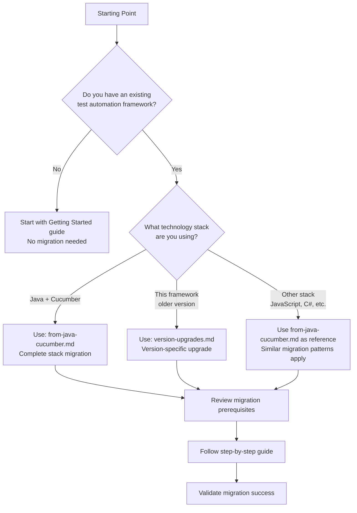

# Migration Guides

## Overview

This section provides comprehensive guides for migrating to and between versions of the Testinium QA Python test automation framework. Whether you're migrating from a different technology stack or upgrading between framework versions, these guides will help you navigate the migration process successfully.

## Available Migration Guides

### [Migrating from Java/Cucumber to Python/Behave](from-java-cucumber.md)

**When to use this guide:**
- You have an existing Java-based Selenium + Cucumber BDD test automation framework
- You're planning to migrate your test automation to Python + Behave
- You need to understand pattern equivalents between Java and Python test frameworks
- You want to maintain behavioral equivalence while modernizing your technology stack

**What this guide covers:**
- Complete technology stack migration strategy (Java → Python)
- Framework equivalence patterns (Cucumber → Behave, JUnit → pytest)
- Page Object Model transformation (PageFactory → property-based locators)
- Step definition migration (@Given/@When/@Then patterns)
- Configuration management migration (properties files → YAML/environment variables)
- WebDriver management patterns (InheritableThreadLocal → threading.local())
- Build system migration (Maven → pip/Poetry)
- Dependency mapping and equivalents
- Common migration pitfalls and solutions
- Complete code transformation examples

**Who should read this guide:**
- Java developers transitioning to Python test automation
- Teams migrating existing Java test suites to Python
- Architects planning test framework modernization
- QA engineers learning Python equivalents of Java patterns

### [Framework Version Upgrades](version-upgrades.md)

**When to use this guide:**
- You're upgrading between major or minor versions of this framework
- You need to understand breaking changes in new framework versions
- You want to ensure smooth version transitions with minimal disruption
- You need migration steps for specific version upgrades

**What this guide covers:**
- Version-specific upgrade procedures
- Breaking changes and deprecations
- Configuration changes between versions
- Dependency updates and compatibility
- Code modification requirements
- Rollback procedures if needed
- Version compatibility matrix
- Upgrade verification steps

**Who should read this guide:**
- Existing users of the framework upgrading to newer versions
- DevOps engineers managing framework deployments
- Development teams maintaining test automation codebases

---

## Migration Decision Guide

### Which Guide Do I Need?

Use this decision tree to determine which migration guide is right for your situation:



### Quick Migration Scenarios

| Your Situation | Recommended Guide | Estimated Effort |
|----------------|-------------------|------------------|
| Java Selenium + Cucumber BDD framework | [from-java-cucumber.md](from-java-cucumber.md) | 2-4 weeks (depending on test suite size) |
| Framework version 1.x → 2.x | [version-upgrades.md](version-upgrades.md) | 4-8 hours |
| JavaScript/TypeScript WebDriver framework | Adapt patterns from [from-java-cucumber.md](from-java-cucumber.md) | 2-3 weeks |
| C# SpecFlow framework | Adapt patterns from [from-java-cucumber.md](from-java-cucumber.md) | 2-3 weeks |
| Ruby + Cucumber framework | Adapt patterns from [from-java-cucumber.md](from-java-cucumber.md) | 1-2 weeks |
| Fresh installation (no migration) | See [Getting Started](../getting-started/index.md) | 2-4 hours |

---

## Migration Prerequisites

### Common Prerequisites (All Migrations)

Before beginning any migration, ensure you have:

#### 1. **Environment Setup**
   - Python 3.9+ installed (3.11 or 3.12 recommended)
   - pip package manager (version 23.0+)
   - Virtual environment tool (venv, virtualenv, or conda)
   - Git version control system
   - Code editor or IDE with Python support

#### 2. **Knowledge Requirements**
   - Basic Python programming knowledge
   - Understanding of Selenium WebDriver concepts
   - Familiarity with BDD (Behavior-Driven Development) principles
   - Knowledge of Gherkin syntax for feature files
   - Understanding of Page Object Model pattern

#### 3. **Access and Permissions**
   - Access to source code repository
   - Credentials for application under test (staging/test environment)
   - Permission to install Python packages
   - Access to CI/CD systems (if integrating automated tests)

#### 4. **Documentation and Inventory**
   - Complete inventory of existing test scenarios
   - Documentation of custom wait strategies or utilities
   - List of test data sources and dependencies
   - Configuration documentation (browsers, timeouts, environments)

#### 5. **Backup and Version Control**
   - Create backup of existing test framework
   - Establish new Git branch for migration work
   - Document current test execution baseline (pass rates, execution times)
   - Tag current version in version control

### Technology Stack Migration Prerequisites (Java/Cucumber → Python/Behave)

Additional prerequisites for complete stack migrations:

#### 1. **Source Code Analysis**
   - Complete inventory of all Java source files
   - List of all Maven dependencies
   - Documentation of custom Java utilities or helpers
   - Identification of Java-specific patterns requiring transformation

#### 2. **Test Coverage Baseline**
   - Current test execution results (establish baseline)
   - Known flaky tests or issues in Java version
   - Test execution time metrics
   - Test coverage metrics

#### 3. **Environment Parity**
   - Ensure Python environment can access same test environments as Java version
   - Verify WebDriver compatibility with target browsers
   - Confirm network access and firewall rules
   - Test database or API connectivity if applicable

#### 4. **Team Preparation**
   - Team training on Python basics (if needed)
   - Introduction to Behave framework
   - Review of Python coding standards
   - Establishment of code review process for migrated code

---

## Migration Preparation Checklist

Use this checklist to prepare for your migration:

### Pre-Migration Planning

- [ ] **Identify migration type** (technology stack migration vs. version upgrade)
- [ ] **Select appropriate migration guide** (from decision tree above)
- [ ] **Review complete migration guide** before starting
- [ ] **Estimate effort and timeline** based on test suite size
- [ ] **Allocate team resources** for migration work
- [ ] **Schedule migration phases** (if phased approach)
- [ ] **Identify migration risks** and mitigation strategies
- [ ] **Establish rollback plan** in case of issues

### Environment Preparation

- [ ] **Install Python 3.9+** and verify installation
- [ ] **Create virtual environment** for the project
- [ ] **Install framework dependencies** (Selenium, Behave, pytest)
- [ ] **Configure IDE or editor** with Python support
- [ ] **Set up code formatting tools** (Black, isort, pylint)
- [ ] **Install WebDriver binaries** or webdriver-manager
- [ ] **Clone or create project repository** for migrated code

### Documentation and Baseline

- [ ] **Document current test suite** (count, categories, execution time)
- [ ] **Capture current test results** (establish baseline for validation)
- [ ] **Create test data inventory** (what data is needed)
- [ ] **Document configuration options** used in current framework
- [ ] **List all custom utilities** or helpers to migrate
- [ ] **Identify integration points** (CI/CD, reporting, test management tools)
- [ ] **Create migration tracking document** (progress tracking)

### Team Preparation

- [ ] **Conduct Python/Behave training** (if needed)
- [ ] **Review Page Object Model patterns** in Python
- [ ] **Establish coding standards** for Python test code
- [ ] **Set up code review process** for migrated code
- [ ] **Define success criteria** for migration completion
- [ ] **Schedule team check-ins** for migration progress review

---

## General Migration Best Practices

### 1. **Incremental Migration Approach**

**Recommended Strategy:**
- Start with simplest test scenarios first
- Migrate one feature area at a time
- Validate each migrated component before proceeding
- Run both old and new frameworks in parallel during transition
- Gradually deprecate old framework once confidence is established

**Benefits:**
- Reduces risk of complete migration failure
- Allows learning and adjustment during process
- Maintains test coverage throughout migration
- Enables early detection of migration issues

### 2. **Maintain Behavioral Equivalence**

**Key Principle:** The migrated tests must produce identical results to the original tests.

**Validation Approach:**
- Execute same test scenarios in both frameworks
- Compare test results (pass/fail/skip counts)
- Verify error messages and failure modes match
- Ensure test execution times are comparable
- Validate reporting outputs contain same information

**Warning Signs:**
- Tests passing in old framework but failing in new framework
- Different failure messages for same test conditions
- Significant differences in execution time
- Missing test coverage in migrated version

### 3. **Preserve Test Readability and Maintainability**

**Best Practices:**
- Use idiomatic Python code patterns (not direct Java→Python translation)
- Follow PEP 8 style guide for Python code
- Write clear, descriptive method and variable names
- Add comprehensive docstrings to all classes and methods
- Include inline comments explaining complex logic
- Use type hints for better code clarity and IDE support

**Example - Avoid Direct Translation:**

```python
# ❌ BAD: Direct Java translation (non-idiomatic Python)
def setUserName(self, userName):
    self.userNameField.sendKeys(userName)
    return None

# ✅ GOOD: Idiomatic Python
def enter_username(self, username: str) -> None:
    """Enter username into the login form field.
    
    Args:
        username: Username to enter in the login field
    """
    self.wait_for_element(self._INPUT_USERNAME).send_keys(username)
```

### 4. **Leverage Python Framework Strengths**

**Take Advantage Of:**
- **Property decorators** for cleaner element access patterns
- **Context managers** for setup/teardown operations
- **List comprehensions** for data transformation
- **Generators** for lazy evaluation where appropriate
- **Decorators** for cross-cutting concerns (logging, retries, etc.)
- **Type hints** for better IDE support and documentation
- **Python standard library** for common operations

### 5. **Implement Comprehensive Error Handling**

**Error Handling Strategy:**
- Catch and handle Selenium exceptions appropriately
- Provide clear, actionable error messages
- Take screenshots on test failures
- Capture browser console logs for debugging
- Log stack traces with sufficient context
- Implement retry logic for flaky interactions (with caution)

### 6. **Maintain Test Data Independence**

**Best Practices:**
- Avoid hard-coded test data in code
- Use external configuration files or databases for test data
- Generate unique test data to avoid conflicts in parallel execution
- Clean up test data after test execution
- Document test data requirements clearly

### 7. **Implement Robust Wait Strategies**

**Recommended Approach:**
- Use **explicit waits only** (avoid implicit waits)
- Implement wait helper utilities for common wait conditions
- Configure reasonable timeout values (not too short, not too long)
- Wait for specific conditions, not fixed time delays
- Handle timeout exceptions with clear error messages

**Example:**

```python
# ✅ GOOD: Explicit wait for specific condition
def wait_for_clickable(self, locator: Tuple[By, str], timeout: int = 10) -> WebElement:
    """Wait for element to be clickable.
    
    Args:
        locator: Element locator tuple (By type, locator string)
        timeout: Maximum wait time in seconds
        
    Returns:
        WebElement once clickable
        
    Raises:
        TimeoutException: If element not clickable within timeout
    """
    return WebDriverWait(self.driver, timeout).until(
        EC.element_to_be_clickable(locator)
    )
```

### 8. **Ensure Thread Safety for Parallel Execution**

**Critical Considerations:**
- Use `threading.local()` for thread-local WebDriver instances
- Avoid shared mutable state between tests
- Ensure configuration objects are thread-safe
- Use thread-safe screenshot and logging mechanisms
- Test parallel execution thoroughly before production use

### 9. **Comprehensive Testing of Migrated Code**

**Validation Strategy:**
- **Unit Tests:** Test utility classes and helpers in isolation
- **Integration Tests:** Verify page objects and step definitions work together
- **End-to-End Tests:** Execute complete BDD scenarios against application
- **Parallel Execution Tests:** Verify framework works correctly in parallel mode
- **Cross-Browser Tests:** Validate functionality across target browsers
- **Performance Tests:** Ensure execution times are acceptable

### 10. **Documentation and Knowledge Transfer**

**Essential Documentation:**
- Update README with Python-specific setup instructions
- Document all configuration options and environment variables
- Create troubleshooting guide for common issues
- Write migration completion report documenting changes
- Create runbook for CI/CD integration
- Document any deviation from original behavior (with justification)

**Knowledge Transfer Activities:**
- Conduct code walkthrough sessions with team
- Provide hands-on training for Python-specific patterns
- Create video tutorials for common tasks
- Establish code review process for ongoing maintenance
- Document lessons learned during migration

---

## Migration Validation Criteria

### How to Know Your Migration is Successful

✅ **Code Quality Validation**
- All Python files compile without errors
- No syntax errors or import issues
- Code passes linting checks (pylint, flake8)
- Code is formatted consistently (Black, isort)
- Type hints are present and correct (mypy validation)

✅ **Functional Validation**
- All test scenarios execute successfully
- Test results match baseline from original framework
- Error handling works as expected
- Screenshots captured on failures
- Test reports generated correctly

✅ **Test Coverage Validation**
- All original test scenarios migrated
- No test coverage gaps introduced
- All edge cases still tested
- Data-driven tests work correctly

✅ **Performance Validation**
- Test execution times comparable to original
- Parallel execution works correctly
- Memory usage is acceptable
- No performance regressions introduced

✅ **Integration Validation**
- CI/CD pipelines execute tests successfully
- Test results published to reporting systems
- Integration with test management tools working
- Notifications and alerts functioning

✅ **Documentation Validation**
- README updated with accurate setup instructions
- API documentation complete and accurate
- Troubleshooting guide covers common issues
- Migration report documents all changes

---

## Common Migration Pitfalls to Avoid

### 1. **Direct Language Translation Without Idiomatic Adaptation**

**Problem:** Translating Java code line-by-line to Python without using Python idioms.

**Solution:** Learn and apply Pythonic patterns (list comprehensions, context managers, decorators, etc.).

### 2. **Mixing Implicit and Explicit Waits**

**Problem:** Using both implicit waits and explicit waits can cause unpredictable behavior.

**Solution:** Use **explicit waits exclusively** with clear timeout handling.

### 3. **Insufficient Error Handling**

**Problem:** Not handling Selenium exceptions leads to cryptic error messages.

**Solution:** Catch specific exceptions and provide actionable error messages.

### 4. **Thread Safety Issues in Parallel Execution**

**Problem:** Shared WebDriver instances or mutable state causing test failures in parallel mode.

**Solution:** Use `threading.local()` for WebDriver instances and avoid shared state.

### 5. **Hard-Coded Configuration**

**Problem:** Environment-specific values hard-coded in test code.

**Solution:** Use configuration files and environment variables for all environment-specific values.

### 6. **Incomplete Test Data Management**

**Problem:** Test data conflicts when running tests in parallel or across environments.

**Solution:** Generate unique test data or use proper test data isolation strategies.

### 7. **Skipping Validation Steps**

**Problem:** Assuming migrated code works without thorough testing.

**Solution:** Follow comprehensive validation checklist before considering migration complete.

### 8. **Inadequate Documentation**

**Problem:** Team members struggle to work with migrated code due to poor documentation.

**Solution:** Prioritize documentation from the start of migration process.

### 9. **Ignoring Code Quality Standards**

**Problem:** Migrated code doesn't follow Python best practices or PEP 8.

**Solution:** Use linting tools, formatters, and enforce code reviews.

### 10. **Not Planning for Rollback**

**Problem:** Issues discovered after migration with no rollback plan.

**Solution:** Maintain ability to run old framework until new framework is proven stable.

---

## Support and Additional Resources

### Framework Documentation

- **[Getting Started Guide](../getting-started/index.md)** - Initial framework setup and first test execution
- **[User Guides](../guides/index.md)** - Feature-specific testing guides and best practices
- **[API Reference](../api-reference/index.md)** - Complete API documentation for all framework components
- **[Architecture Documentation](../architecture/index.md)** - System architecture and design patterns
- **[Deployment Guides](../deployment/index.md)** - Deployment to various environments
- **[Troubleshooting](../troubleshooting/index.md)** - Common issues and solutions

### External Resources

#### Python and Selenium Resources

- **[Python Official Documentation](https://docs.python.org/3/)** - Python language reference
- **[PEP 8 Style Guide](https://pep8.org/)** - Python coding conventions
- **[Selenium Python Documentation](https://selenium-python.readthedocs.io/)** - Official Selenium Python bindings docs
- **[WebDriver W3C Specification](https://w3c.github.io/webdriver/)** - WebDriver standard specification

#### Behave and BDD Resources

- **[Behave Documentation](https://behave.readthedocs.io/)** - Official Behave framework documentation
- **[Gherkin Syntax Reference](https://cucumber.io/docs/gherkin/)** - Gherkin language specification
- **[BDD Best Practices](https://cucumber.io/docs/bdd/)** - Behavior-Driven Development principles

#### Testing Best Practices

- **[Test Automation Patterns](https://testautomationpatterns.org/)** - Comprehensive test automation patterns
- **[Page Object Model Pattern](https://www.selenium.dev/documentation/test_practices/encouraged/page_object_models/)** - Official Selenium POM documentation
- **[Python Testing Best Practices](https://docs.python-guide.org/writing/tests/)** - Hitchhiker's Guide to Python testing

### Community and Support

#### Getting Help

- **GitHub Issues** - Report bugs or request features in the project repository
- **Stack Overflow** - Search for or ask questions tagged with `selenium-python`, `behave`, `bdd`
- **Python Discord** - Real-time chat with Python community members

#### Contributing

If you identify issues in the migration guides or have suggestions for improvement:

1. Review the [Contributing Guidelines](../contributing/index.md)
2. Open an issue describing the problem or suggestion
3. Submit a pull request with improvements (if applicable)

---

## Migration Timeline Examples

### Small Test Suite (< 50 scenarios)

**Technology Stack Migration (Java/Cucumber → Python/Behave):**
- **Planning and Preparation:** 1-2 days
- **Environment Setup:** 4-6 hours
- **Core Framework Migration:** 3-5 days
- **Test Migration:** 1-2 weeks
- **Validation and Testing:** 2-3 days
- **Documentation:** 1-2 days
- **Total:** 2-3 weeks

**Version Upgrade:**
- **Review release notes:** 1-2 hours
- **Update dependencies:** 2-3 hours
- **Code modifications:** 2-4 hours
- **Validation:** 2-3 hours
- **Total:** 1 day

### Medium Test Suite (50-200 scenarios)

**Technology Stack Migration (Java/Cucumber → Python/Behave):**
- **Planning and Preparation:** 3-5 days
- **Environment Setup:** 1 day
- **Core Framework Migration:** 1 week
- **Test Migration:** 2-3 weeks
- **Validation and Testing:** 3-5 days
- **Documentation:** 2-3 days
- **Total:** 4-6 weeks

**Version Upgrade:**
- **Review release notes:** 2-3 hours
- **Update dependencies:** 3-4 hours
- **Code modifications:** 4-8 hours
- **Validation:** 4-6 hours
- **Total:** 1-2 days

### Large Test Suite (> 200 scenarios)

**Technology Stack Migration (Java/Cucumber → Python/Behave):**
- **Planning and Preparation:** 1-2 weeks
- **Environment Setup:** 2-3 days
- **Core Framework Migration:** 1-2 weeks
- **Test Migration (phased):** 4-8 weeks
- **Validation and Testing:** 1-2 weeks
- **Documentation:** 3-5 days
- **Total:** 8-14 weeks

**Version Upgrade:**
- **Review release notes:** 4-6 hours
- **Update dependencies:** 4-6 hours
- **Code modifications:** 1-2 days
- **Validation:** 1 day
- **Total:** 2-3 days

**Note:** Timelines assume team familiarity with both source and target technologies. Add 20-30% to estimates for teams new to Python or Behave.

---

## Next Steps

### For Technology Stack Migrations

1. **Read the complete migration guide:** [Migrating from Java/Cucumber to Python/Behave](from-java-cucumber.md)
2. **Complete the prerequisites checklist** (above)
3. **Set up your Python development environment**
4. **Start with a pilot migration** of 1-2 simple test scenarios
5. **Validate the pilot** thoroughly before proceeding
6. **Continue incremental migration** following the guide

### For Version Upgrades

1. **Read the version-specific upgrade guide:** [Framework Version Upgrades](version-upgrades.md)
2. **Review the changelog** for your target version
3. **Create a backup** of your current installation
4. **Follow the upgrade procedure** step-by-step
5. **Validate the upgrade** using the checklist
6. **Update documentation** to reflect any changes

### For Fresh Installations

If you don't have an existing framework to migrate:

1. **Skip migration guides** - no migration needed
2. **Go to [Getting Started](../getting-started/index.md)** for initial setup
3. **Follow the [Quick Start Guide](../getting-started/quick-start.md)** for your first test
4. **Explore [User Guides](../guides/index.md)** for feature-specific guidance

---

## Feedback and Improvements

Migration guides are living documents that improve through user feedback. If you encounter:

- **Unclear instructions** - Let us know which steps need clarification
- **Missing information** - Tell us what additional details would be helpful
- **Errors or issues** - Report problems you encountered during migration
- **Success stories** - Share what worked well to help others

Please contribute feedback through:
- GitHub Issues in the project repository
- Pull requests with documentation improvements
- Community forums and discussions

Your migration experience helps improve these guides for future users.

---

**Ready to begin your migration?** Select the appropriate guide above and let's get started! 🚀
