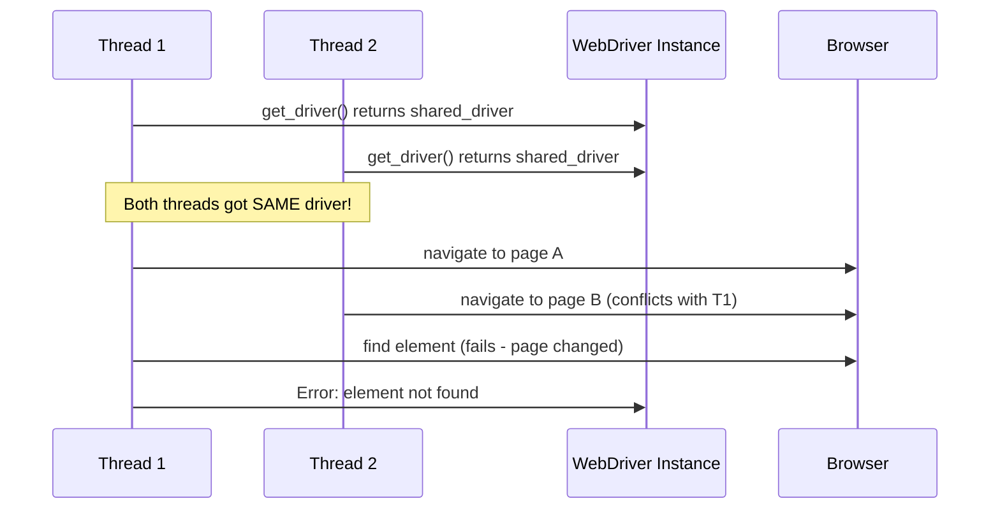

# Parallel Execution Troubleshooting

Comprehensive troubleshooting guide for parallel test execution issues, covering thread-safety, driver conflicts, resource contention, and performance optimization.

## Overview

Parallel test execution allows you to run multiple tests simultaneously, significantly reducing total execution time. However, parallel execution introduces complexity around thread safety, resource isolation, and coordination. This guide addresses common issues that arise when running tests in parallel using `behave-parallel` (process-based) or `pytest-xdist` (thread/process-based) parallelism.

**When to use this guide:**
- Tests pass locally but fail in parallel execution
- Driver initialization errors in parallel runs
- Screenshot or report generation failures
- Performance degradation with parallel execution
- Debugging parallel execution issues

**Prerequisites:**
- Framework installed and configured
- Understanding of basic thread concepts
- Familiarity with behave or pytest execution

**Source:** `utilities/driver_manager.py`, `README.md`, `behave.ini`, `pytest.ini`

---

## Thread-Safety Issues

### Understanding threading.local() Pattern

The framework uses Python's `threading.local()` to provide thread-level isolation for WebDriver instances, ensuring each thread/process gets its own independent driver.

**Architecture:**

```mermaid
graph TB
    subgraph "Main Process"
        BP[Behave/pytest Main]
    end
    
    subgraph "Worker 1"
        W1[Worker Thread 1]
        TL1[threading.local()]
        D1[WebDriver Instance 1]
        W1 --> TL1
        TL1 --> D1
    end
    
    subgraph "Worker 2"
        W2[Worker Thread 2]
        TL2[threading.local()]
        D2[WebDriver Instance 2]
        W2 --> TL2
        TL2 --> D2
    end
    
    subgraph "Worker 3"
        W3[Worker Thread 3]
        TL3[threading.local()]
        D3[WebDriver Instance 3]
        W3 --> TL3
        TL3 --> D3
    end
    
    BP --> W1
    BP --> W2
    BP --> W3
    
    style TL1 fill:#90EE90
    style TL2 fill:#90EE90
    style TL3 fill:#90EE90
```

**How threading.local() provides thread isolation:**

```python
# From utilities/driver_manager.py lines 127-129
class DriverManager:
    # Thread-local storage for WebDriver instances
    # Replaces Java's InheritableThreadLocal<WebDriver> driverPool
    _thread_local = threading.local()
```

**Key guarantee:** Each thread calling `DriverManager.get_driver()` receives its own WebDriver instance stored in thread-local storage. No shared state between threads.

**Source:** `utilities/driver_manager.py:82-99, 127-129`

### Issue 1: Shared State Between Threads

**Symptoms:**
```
StaleElementReferenceException: stale element reference: element is not attached to the page document
WebDriverException: chrome not reachable
```

**Cause:** Page objects or step definitions inadvertently sharing mutable state across threads.

**Example of INCORRECT code:**

```python
# WRONG: Class-level driver (shared across threads)
class LoginPage:
    driver = None  # DANGER: Shared across all instances
    
    def __init__(self):
        self.driver = DriverManager.get_driver()  # Overwrites shared variable
```

**Correct implementation:**

```python
# CORRECT: Instance-level driver (thread-isolated)
class LoginPage:
    def __init__(self):
        self.driver = DriverManager.get_driver()  # Each instance gets own driver
        # driver stored per instance, not per class
```

**Solution:**
1. **Never use class-level variables for WebDriver or elements**
2. **Always store driver as instance variable:** `self.driver`
3. **Use property-based locators** to re-locate elements on each access
4. **Avoid global variables** for test state

**Verification:** Check all page objects for class-level mutable state:
```bash
# Search for potential class-level driver assignments
grep -rn "driver = " pages/

# Should only see instance assignments: self.driver = ...
# NOT: driver = None at class level
```

**Source:** `pages/base_page.py:20-50`, `utilities/driver_manager.py:164-196`

### Issue 2: Driver Not Initialized in Worker Thread

**Symptoms:**
```
AttributeError: 'thread._local' object has no attribute 'driver'
DriverInitializationError: No WebDriver found for thread 'Worker-2'
```

**Cause:** Worker thread calling `quit_driver()` before `get_driver()`, or driver initialization failing silently.

**Error Example:**
```python
# Behave scenario in worker thread
def before_scenario(context, scenario):
    # This should work - creates driver if needed
    context.driver = DriverManager.get_driver()

def after_scenario(context, scenario):
    # This might fail if driver never created successfully
    DriverManager.quit_driver()
```

**Diagnostic Commands:**
```python
# Add to your test hooks for debugging
from utilities.driver_manager import DriverManager
import threading

def before_scenario(context, scenario):
    thread_name = threading.current_thread().name
    print(f"[{thread_name}] Initializing driver for scenario: {scenario.name}")
    
    status = DriverManager.get_thread_driver_status()
    print(f"[{thread_name}] Driver status before: {status}")
    
    context.driver = DriverManager.get_driver()
    
    status = DriverManager.get_thread_driver_status()
    print(f"[{thread_name}] Driver status after: {status}")
```

**Solution:**
1. **Verify driver creation succeeds:** Check logs for `DriverInitializationError`
2. **Check threading.local() has driver attribute:**
   ```python
   if hasattr(cls._thread_local, 'driver') and cls._thread_local.driver is not None:
       return cls._thread_local.driver
   ```
3. **Use get_thread_driver_status() for debugging:**
   ```python
   status = DriverManager.get_thread_driver_status()
   assert status['has_driver'] == True, f"Driver not initialized: {status}"
   ```

**Source:** `utilities/driver_manager.py:164-196, 464-509`

### Issue 3: Thread Isolation Verification

**How to verify thread isolation is working correctly:**

**Test script:**
```python
# test_thread_isolation.py
import threading
import time
from utilities.driver_manager import DriverManager

def worker(worker_id):
    """Each worker gets its own driver"""
    print(f"Worker {worker_id} starting...")
    
    # Get driver for this thread
    driver = DriverManager.get_driver()
    status = DriverManager.get_thread_driver_status()
    
    print(f"Worker {worker_id}: Session ID = {status['driver_session']}")
    print(f"Worker {worker_id}: Thread = {status['thread_name']}")
    
    # Navigate to test page
    driver.get("https://example.com")
    time.sleep(2)  # Simulate test execution
    
    # Cleanup
    DriverManager.quit_driver()
    print(f"Worker {worker_id} completed")

# Create multiple threads
threads = []
for i in range(3):
    t = threading.Thread(target=worker, args=(i,), name=f"Worker-{i}")
    threads.append(t)
    t.start()

# Wait for all threads to complete
for t in threads:
    t.join()

print("All workers completed - each had unique session ID")
```

**Expected output:**
```
Worker 0: Session ID = 123abc...
Worker 0: Thread = Worker-0
Worker 1: Session ID = 456def...  # Different session ID
Worker 1: Thread = Worker-1
Worker 2: Session ID = 789ghi...  # Different session ID
Worker 2: Thread = Worker-2
```

**If session IDs are the same:** Thread isolation is NOT working - check for shared driver instances.

**Source:** `utilities/driver_manager.py:464-509`

---

## Driver Conflicts in Parallel Tests

### Issue 4: Multiple Drivers Accessing Same Browser Session

**Symptoms:**
```
WebDriverException: invalid session id
NoSuchWindowException: no such window: target window already closed
```

**Cause:** Two threads trying to control the same browser session, usually from incorrect driver reuse.

**Sequence diagram of the problem:**



**Solution:** Ensure threading.local() is used correctly.

**Verification checklist:**
- [ ] DriverManager uses `threading.local()` for storage (line 129)
- [ ] Each thread calls `get_driver()` independently
- [ ] No driver instances stored in class-level variables
- [ ] No driver instances passed between threads

**Code review:**
```python
# CORRECT: Thread-local driver access
class DriverManager:
    _thread_local = threading.local()  # ✓ Thread-local storage
    
    @classmethod
    def get_driver(cls) -> WebDriver:
        if not hasattr(cls._thread_local, 'driver') or cls._thread_local.driver is None:
            cls._thread_local.driver = cls._create_driver()  # ✓ Per-thread
        return cls._thread_local.driver
```

**Source:** `utilities/driver_manager.py:127-196`

### Issue 5: Driver Cleanup in Wrong Thread

**Symptoms:**
```
# Thread 1's test fails
# Thread 2's driver mysteriously closes
WebDriverException: chrome not reachable (Driver cleanup happened in wrong thread)
```

**Cause:** Calling `quit_driver()` closes the driver for the CURRENT thread only, but if driver references leak between threads, other threads may be affected.

**Diagnostic:**
```python
# Add thread tracking to your hooks
import threading

def after_scenario(context, scenario):
    thread_name = threading.current_thread().name
    print(f"[{thread_name}] Cleaning up after scenario: {scenario.name}")
    
    status_before = DriverManager.get_thread_driver_status()
    print(f"[{thread_name}] Status before quit: {status_before}")
    
    DriverManager.quit_driver()
    
    status_after = DriverManager.get_thread_driver_status()
    print(f"[{thread_name}] Status after quit: {status_after}")
    assert status_after['has_driver'] == False, "Driver not cleaned up!"
```

**Solution:**
```python
# Thread-safe cleanup from utilities/driver_manager.py:381-463
@classmethod
def quit_driver(cls) -> None:
    """Quit WebDriver and remove thread-local reference."""
    thread_name = threading.current_thread().name
    
    if hasattr(cls._thread_local, 'driver') and cls._thread_local.driver is not None:
        try:
            cls._thread_local.driver.quit()
        except Exception as exc:
            logger.error(f"Error quitting driver in thread '{thread_name}': {exc}")
        finally:
            # CRITICAL: Always remove thread-local reference
            cls._thread_local.driver = None
```

**Key points:**
- `quit_driver()` only affects current thread's driver
- Thread-local reference always cleared in `finally` block
- Safe to call multiple times (idempotent)
- Does not affect other threads' drivers

**Source:** `utilities/driver_manager.py:381-463`

---

## Resource Contention

### Issue 6: File System Conflicts for Screenshots/Reports

**Symptoms:**
```
PermissionError: [Errno 13] Permission denied: 'reports/screenshots/test_login.png'
OSError: [Errno 17] File exists: 'reports/screenshots/test_login.png'
```

**Cause:** Multiple parallel workers trying to write to the same screenshot file simultaneously.

**Problem scenario:**
```
Thread 1: test_login.py → writes screenshot → reports/screenshots/test_login.png
Thread 2: test_login.py → writes screenshot → reports/screenshots/test_login.png (CONFLICT!)
```

**Solution:** Add thread/process ID to screenshot filenames.

**Correct implementation:**
```python
# From utilities/screenshot_helper.py
import threading
import os
from datetime import datetime

def capture_screenshot(driver, scenario_name):
    """Capture screenshot with thread-safe filename"""
    thread_name = threading.current_thread().name
    timestamp = datetime.now().strftime("%Y%m%d_%H%M%S_%f")
    
    # Include thread name for uniqueness
    filename = f"{sanitize_filename(scenario_name)}_{thread_name}_{timestamp}.png"
    filepath = os.path.join("reports", "screenshots", filename)
    
    # Ensure directory exists
    os.makedirs(os.path.dirname(filepath), exist_ok=True)
    
    driver.save_screenshot(filepath)
    return filepath

def sanitize_filename(name):
    """Remove invalid filename characters"""
    import re
    return re.sub(r'[^\w\s-]', '', name).strip().replace(' ', '_')
```

**Result:**
```
reports/screenshots/test_login_Worker-0_20231029_143052_123456.png
reports/screenshots/test_login_Worker-1_20231029_143052_234567.png
reports/screenshots/test_login_Worker-2_20231029_143052_345678.png
```

**Source:** `utilities/screenshot_helper.py`, `README.md:677-684`

### Issue 7: Port Conflicts for Drivers

**Symptoms:**
```
WebDriverException: chrome not reachable
URLError: [Errno 48] Address already in use
```

**Cause:** WebDriver by default tries to use specific ports. Multiple drivers starting simultaneously may conflict.

**Solution:** WebDriver automatically selects available ports with `webdriver-manager`, but verify:

```python
# Selenium 4.x automatically handles port selection
from selenium import webdriver
from selenium.webdriver.chrome.service import Service
from webdriver_manager.chrome import ChromeDriverManager

# Each driver instance gets unique port automatically
chrome_service = Service(ChromeDriverManager().install())
driver = webdriver.Chrome(service=chrome_service)  # Auto-selects free port
```

**Verify no port conflicts:**
```bash
# During test execution, check active ChromeDriver ports
netstat -an | grep LISTEN | grep -E "9515|9516|9517|9518"

# Each worker should use different port
```

**If port conflicts occur:**
- Reduce number of parallel workers
- Check for zombie ChromeDriver processes: `ps aux | grep chromedriver`
- Kill stuck processes: `pkill chromedriver`

**Source:** `utilities/driver_manager.py:199-379`

### Issue 8: Memory Limits with Multiple Browsers

**Symptoms:**
```
# Tests start failing after N parallel workers
MemoryError: Unable to allocate memory for driver
System appears unresponsive during test execution
```

**Diagnosis:**
```bash
# Monitor memory usage during parallel execution
watch -n 1 'ps aux | grep chrome | grep -v grep | wc -l; free -h'

# Expected: Number of chrome processes = number of workers
# Each chrome instance: ~200-500MB RAM
```

**Calculation:**
```
Available RAM: 8GB
Chrome per instance: 400MB
Framework overhead: 500MB

Max safe workers = (8GB - 500MB) / 400MB ≈ 18 workers

Recommended: Use 50-75% of max = 9-13 workers
```

**Solution:**
```bash
# Limit parallel workers based on available resources
# behave-parallel
behave --processes 8 --parallel-element scenario  # 8 workers for 8GB RAM

# pytest-xdist
pytest -n 8  # 8 workers

# Automatic CPU-based (may exceed memory)
pytest -n auto  # Uses CPU count - may be too many!
```

**Enable headless mode to reduce memory:**
```yaml
# config/config.yaml
browser:
  type: chrome
  headless: true  # Reduces memory by ~30%
```

**Source:** `config/config.yaml`, `README.md:664-675`

---

## Process vs Thread Parallelism

### Comparison: behave-parallel vs pytest-xdist

| Feature | behave-parallel | pytest-xdist |
|---------|----------------|--------------|
| **Parallelism Type** | Process-based | Thread or Process-based |
| **Installation** | `pip install behave-parallel` | `pip install pytest-xdist` |
| **Command** | `behave --processes 4 --parallel-element scenario` | `pytest -n 4` or `pytest -n auto` |
| **Thread Safety** | Excellent (separate processes) | Good (configurable) |
| **Resource Overhead** | Higher (process spawning) | Lower (thread/process options) |
| **Report Aggregation** | Requires custom handling | Built-in aggregation |
| **Fixture Sharing** | No (isolated processes) | Yes (with proper scope) |
| **Best For** | Behave/Gherkin scenarios | pytest-based tests |
| **Compatibility** | Works with threading.local() | Works with threading.local() |
| **Debug Difficulty** | Harder (separate processes) | Easier (threads in same process) |
| **Speed** | Fast (true parallelism) | Fast (configurable) |

**Source:** `behave.ini:95-128`, `pytest.ini:104-109`, `README.md:180-191`

### Issue 9: behave-parallel Specific Issues

**Installation and basic usage:**
```bash
# Install behave-parallel
pip install behave-parallel

# Run with 4 worker processes
behave --processes 4 --parallel-element scenario

# Parallel by feature instead of scenario
behave --processes 4 --parallel-element feature
```

#### Problem 9.1: --processes Flag Not Recognized

**Error:**
```
behave: error: unrecognized arguments: --processes 4
```

**Cause:** `behave-parallel` not installed or not in PATH.

**Solution:**
```bash
# Verify installation
pip list | grep behave-parallel

# If not installed
pip install behave-parallel

# Verify it works
behave --help | grep processes
# Should see: --processes PROCESSES
```

#### Problem 9.2: Report Aggregation Fails

**Issue:** Multiple workers generate separate report files that don't merge.

**Example:**
```
reports/cucumber-0.json
reports/cucumber-1.json
reports/cucumber-2.json
reports/cucumber-3.json
```

**Solution:** Use custom report aggregation script or behave's built-in features:

```python
# scripts/aggregate_reports.py
import json
import glob
import os

def aggregate_cucumber_json():
    """Aggregate parallel Cucumber JSON reports"""
    report_files = glob.glob("reports/cucumber-*.json")
    aggregated = []
    
    for report_file in report_files:
        with open(report_file, 'r') as f:
            data = json.load(f)
            aggregated.extend(data)
    
    with open("reports/cucumber.json", 'w') as f:
        json.dump(aggregated, f, indent=2)
    
    print(f"Aggregated {len(report_files)} reports into reports/cucumber.json")

if __name__ == "__main__":
    aggregate_cucumber_json()
```

**Run after parallel execution:**
```bash
behave --processes 4 --parallel-element scenario
python scripts/aggregate_reports.py
```

#### Problem 9.3: Screenshot Organization Per Process

**Issue:** Screenshots from different processes mixed together.

**Solution:** Organize by worker process:

```python
# In features/environment.py
import os
import threading

def after_scenario(context, scenario):
    if scenario.status == 'failed':
        # Get process/thread identifier
        thread_name = threading.current_thread().name
        worker_id = os.environ.get('BEHAVE_WORKER_ID', 'main')
        
        # Organize by worker
        screenshot_dir = f"reports/screenshots/worker_{worker_id}"
        os.makedirs(screenshot_dir, exist_ok=True)
        
        screenshot_path = os.path.join(
            screenshot_dir,
            f"{scenario.name}_{timestamp}.png"
        )
        context.driver.save_screenshot(screenshot_path)
```

**Source:** `behave.ini:95-128`, `features/environment.py`

### Issue 10: pytest-xdist Specific Issues

**Installation and basic usage:**
```bash
# Install pytest-xdist
pip install pytest-xdist

# Run with 4 workers
pytest -n 4 tests/

# Auto-detect CPU count
pytest -n auto tests/

# Distribute by module (better for fixtures)
pytest -n 4 --dist loadscope tests/
```

#### Problem 10.1: -n Flag Causes Import Errors

**Error:**
```
ImportError: cannot import name 'DriverManager' from 'utilities.driver_manager'
INTERNALERROR> AttributeError: 'NoneType' object has no attribute 'config'
```

**Cause:** pytest-xdist workers don't inherit parent process's Python path or environment.

**Solution 1:** Ensure PYTHONPATH is set:
```bash
export PYTHONPATH="${PYTHONPATH}:$(pwd)"
pytest -n 4 tests/
```

**Solution 2:** Use pytest.ini configuration:
```ini
# pytest.ini
[pytest]
pythonpaths = .
testpaths = tests
```

**Solution 3:** Install framework as package:
```bash
pip install -e .
pytest -n 4 tests/
```

#### Problem 10.2: --dist loadscope vs loadfile

**Issue:** Tests fail in parallel but pass with `--dist loadscope`.

**Understanding distribution strategies:**

| Strategy | Behavior | Use When |
|----------|----------|----------|
| `load` (default) | Distribute individual tests to workers | Tests are completely independent |
| `loadscope` | Group tests by scope (module, class, function) | Tests share fixtures or setup |
| `loadfile` | Group all tests in same file to same worker | Tests in file share state |
| `no` | No distribution (sequential) | Debugging |

**Solution:**
```bash
# If tests share fixtures or state
pytest -n 4 --dist loadscope tests/

# If tests in same file must run together
pytest -n 4 --dist loadfile tests/

# For debugging, disable distribution
pytest -n 4 --dist no tests/  # Runs sequentially despite -n 4
```

#### Problem 10.3: Fixture Scope Issues

**Error:**
```
ScopeMismatch: You tried to access the 'function' scoped fixture 'driver' with a 'session' scoped request object
```

**Cause:** Fixture scope incompatible with parallel execution.

**Example of INCORRECT code:**
```python
# WRONG: Session-scoped driver (shared across all tests)
@pytest.fixture(scope="session")
def driver():
    driver = DriverManager.get_driver()
    yield driver
    DriverManager.quit_driver()
```

**Correct implementation:**
```python
# CORRECT: Function-scoped driver (new driver per test)
@pytest.fixture(scope="function")
def driver():
    driver = DriverManager.get_driver()
    yield driver
    DriverManager.quit_driver()
```

**Session-scoped fixtures in parallel execution:**
```python
# Session-scoped fixtures are shared across ALL workers
# Use only for truly immutable, read-only resources

@pytest.fixture(scope="session")
def config():
    """Config can be session-scoped (read-only)"""
    return ConfigReader()

@pytest.fixture(scope="function")
def driver(config):
    """Driver must be function-scoped (per-test)"""
    driver = DriverManager.get_driver()
    yield driver
    DriverManager.quit_driver()
```

**Source:** `pytest.ini:104-109`, `tests/test_driver_manager.py`

---

## Performance Issues

### Issue 11: Too Many Parallel Workers

**Symptoms:**
- Tests run slower in parallel than sequentially
- System becomes unresponsive
- Browser instances crash or timeout
- Resource exhaustion errors

**Optimal worker count calculation:**

```python
import os
import psutil  # pip install psutil

def calculate_optimal_workers():
    """Calculate optimal number of parallel workers"""
    cpu_count = os.cpu_count()
    available_memory_gb = psutil.virtual_memory().available / (1024**3)
    
    # Each Chrome instance uses ~400MB RAM
    memory_based_limit = int(available_memory_gb / 0.4)
    
    # Use 75% of CPU cores for headroom
    cpu_based_limit = int(cpu_count * 0.75)
    
    # Take minimum of both constraints
    optimal_workers = min(memory_based_limit, cpu_based_limit)
    
    # Cap at reasonable maximum
    optimal_workers = min(optimal_workers, 16)
    
    # At least 1 worker
    optimal_workers = max(optimal_workers, 1)
    
    print(f"CPU cores: {cpu_count}")
    print(f"Available RAM: {available_memory_gb:.1f} GB")
    print(f"CPU-based limit: {cpu_based_limit}")
    print(f"Memory-based limit: {memory_based_limit}")
    print(f"Recommended workers: {optimal_workers}")
    
    return optimal_workers

if __name__ == "__main__":
    workers = calculate_optimal_workers()
    print(f"\nRun with: behave --processes {workers} --parallel-element scenario")
    print(f"Or with:  pytest -n {workers} tests/")
```

**Example output:**
```
CPU cores: 8
Available RAM: 7.8 GB
CPU-based limit: 6
Memory-based limit: 19
Recommended workers: 6

Run with: behave --processes 6 --parallel-element scenario
Or with:  pytest -n 6 tests/
```

### Issue 12: Diminishing Returns

**Performance benchmark:**


**Key insight:** Beyond 8-12 workers, overhead from context switching and resource contention negates benefits.

**Recommended approach:**
```bash
# Measure performance at different worker counts
for workers in 1 2 4 8 12 16; do
    echo "Testing with $workers workers..."
    time behave --processes $workers --parallel-element scenario
done

# Use the sweet spot (usually 4-8 workers)
```

---

## Debugging Parallel Execution

### Issue 13: Logging Per Thread/Process

**Problem:** Logs from multiple workers interleaved, hard to trace.

**Solution:** Add thread/process identifier to all log messages.

**Configure structured logging:**

```python
# In features/environment.py or test setup
import logging
import threading
import os

class ThreadProcessFormatter(logging.Formatter):
    """Custom formatter with thread and process info"""
    
    def format(self, record):
        # Add thread and process info to record
        record.thread_name = threading.current_thread().name
        record.process_id = os.getpid()
        record.worker_id = os.environ.get('PYTEST_XDIST_WORKER', 'main')
        
        return super().format(record)

# Configure logging with thread info
formatter = ThreadProcessFormatter(
    fmt='%(asctime)s [%(worker_id)s] [%(thread_name)s] [%(levelname)s] %(message)s',
    datefmt='%Y-%m-%d %H:%M:%S'
)

handler = logging.StreamHandler()
handler.setFormatter(formatter)

logger = logging.getLogger()
logger.addHandler(handler)
logger.setLevel(logging.INFO)
```

**Output:**
```
2023-10-29 14:30:15 [gw0] [Worker-0] [INFO] Initializing driver for scenario: test_login
2023-10-29 14:30:15 [gw1] [Worker-1] [INFO] Initializing driver for scenario: test_logout
2023-10-29 14:30:16 [gw2] [Worker-2] [INFO] Initializing driver for scenario: test_calendar
```

**Separate log files per worker:**

```python
# Create worker-specific log files
worker_id = os.environ.get('PYTEST_XDIST_WORKER', 'main')
log_file = f"logs/test_execution_{worker_id}.log"

handler = logging.FileHandler(log_file)
handler.setFormatter(formatter)
logger.addHandler(handler)
```

### Issue 14: Reproducing Failures Locally

**Problem:** Test fails in parallel CI but passes locally.

**Debug workflow:**

**Step 1: Identify failing test**
```bash
# Check CI logs for failed test
# Example: test_login failed in worker gw2
```

**Step 2: Run test in isolation**
```bash
# Run just the failing test
behave features/Login.feature:15  # Specific scenario by line number
pytest tests/test_login.py::test_valid_login_credentials -v

# If it passes, it's a parallel-specific issue
```

**Step 3: Run with minimal parallelism**
```bash
# Run with 2 workers to reproduce timing issues
behave --processes 2 --parallel-element scenario
pytest -n 2 tests/
```

**Step 4: Enable verbose logging**
```bash
# Maximum verbosity
behave --verbose --no-capture --logging-level=DEBUG
pytest -vvv --log-cli-level=DEBUG -s
```

**Step 5: Run specific worker configuration**
```bash
# pytest-xdist: Run with same worker that failed
pytest -n 4 --dist loadscope -k test_login
```

### Issue 15: Running Single Worker for Debugging

**Disable parallelism temporarily:**

```bash
# behave: run sequentially
behave features/Login.feature

# pytest: disable xdist
pytest tests/ -n 0  # Or remove -n flag

# pytest: run without xdist plugin
pytest tests/ -p no:xdist
```

**Run with debugger (pdb) - requires single worker:**

```python
# In step definition or test
def test_login():
    driver = DriverManager.get_driver()
    
    import pdb; pdb.set_trace()  # Debugger breaks here
    
    driver.get("https://example.com")
```

```bash
# Must run without parallelism for pdb
pytest tests/test_login.py -s -n 0
behave features/Login.feature --no-capture
```

### Issue 16: Enabling Verbose Output

**behave verbose options:**
```bash
# Show all step details
behave --verbose

# Show captured output
behave --no-capture

# Show debug logging
behave --logging-level=DEBUG

# Combine all
behave --verbose --no-capture --logging-level=DEBUG --show-timings
```

**pytest verbose options:**
```bash
# Increase verbosity
pytest -v tests/        # Verbose
pytest -vv tests/       # More verbose
pytest -vvv tests/      # Very verbose

# Show captured output
pytest -s tests/

# Show log output
pytest --log-cli-level=DEBUG tests/

# Show test durations
pytest --durations=10 tests/  # Show 10 slowest tests

# Combine all
pytest -vvv -s --log-cli-level=DEBUG --durations=10 tests/
```

---

## Diagnostic Commands Reference

### Quick Diagnostics

```bash
# Check if threading.local() is being used
grep -rn "threading.local()" utilities/driver_manager.py

# Verify no class-level drivers in page objects
grep -rn "driver = " pages/ | grep -v "self.driver"

# Check for zombie ChromeDriver processes
ps aux | grep chromedriver | grep -v grep

# Count active Chrome instances during test run
watch -n 1 'ps aux | grep chrome | grep -v grep | wc -l'

# Monitor memory usage
watch -n 1 'free -h'

# Check for port conflicts
netstat -an | grep LISTEN | grep -E "9515|9516|9517|9518"

# View thread status during execution
# Add this to your test hooks:
# DriverManager.get_thread_driver_status()
```

### Performance Profiling

```bash
# Measure execution time by worker count
for workers in 1 2 4 8; do
    echo "Workers: $workers"
    time behave --processes $workers --parallel-element scenario 2>&1 | grep "scenarios passed"
done

# Profile with pytest-benchmark
pytest --benchmark-only tests/

# Memory profiling
pip install memory_profiler
python -m memory_profiler features/environment.py
```

### Report Analysis

```bash
# Count failures by worker (pytest-xdist)
grep "FAILED" logs/*.log | cut -d':' -f1 | sort | uniq -c

# Identify slowest tests
pytest --durations=0 tests/ | head -20

# Check for screenshot generation issues
ls -lh reports/screenshots/ | wc -l
find reports/screenshots/ -size 0  # Find empty screenshots
```

---

## See Also

**Related Documentation:**
- **[Parallel Execution Guide](../guides/parallel-execution.md)** - Setup and configuration for parallel testing
- **[Parallel Execution Architecture](../architecture/parallel-execution.md)** - threading.local() pattern with diagrams
- **[Driver Manager API](../api-reference/utilities/driver-manager.md)** - Thread-safety guarantees
- **[Configuration Guide](../guides/configuration-management.md)** - Environment-specific parallel configuration
- **[Performance Optimization](../guides/extending-framework.md)** - Advanced performance tuning

**External Resources:**
- [behave-parallel documentation](https://github.com/behave/behave-parallel)
- [pytest-xdist documentation](https://pytest-xdist.readthedocs.io/)
- [Python threading.local() documentation](https://docs.python.org/3/library/threading.html#threading.local)
- [Selenium thread safety best practices](https://www.selenium.dev/documentation/webdriver/drivers/thread_safety/)

**Source Files:**
- `utilities/driver_manager.py` - Thread-safe WebDriver management
- `behave.ini` - Parallel execution configuration
- `pytest.ini` - pytest-xdist configuration
- `features/environment.py` - Behave hooks with cleanup
- `README.md` - Parallel execution examples

---

**Last updated:** 2023-10-29  
**Maintainer:** Framework Documentation Team  
**Related issues:** For additional help, see [Common Errors](common-errors.md) or open an issue on GitHub.
